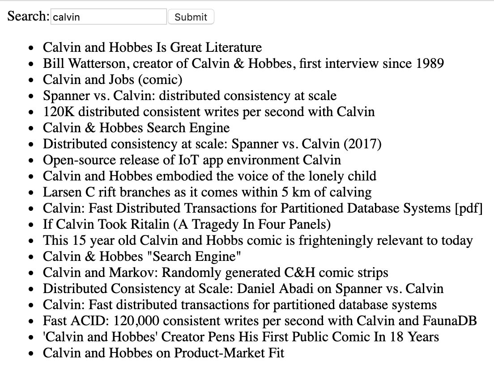

Build Hacker News with GraphQL
===

Start Server
---
```
$ cd server-express
$ yarn start
```

Start Web
---
```
$ cd client
$ yarn start
```

Features
---
- backend
    - [x] basic backend graphQL interface of hacker news
- frontend
    - [x] read
    - [x] search
    - [x] load more
    - [ ] infinite scroll
    - [ ] style

Screenshots
---
